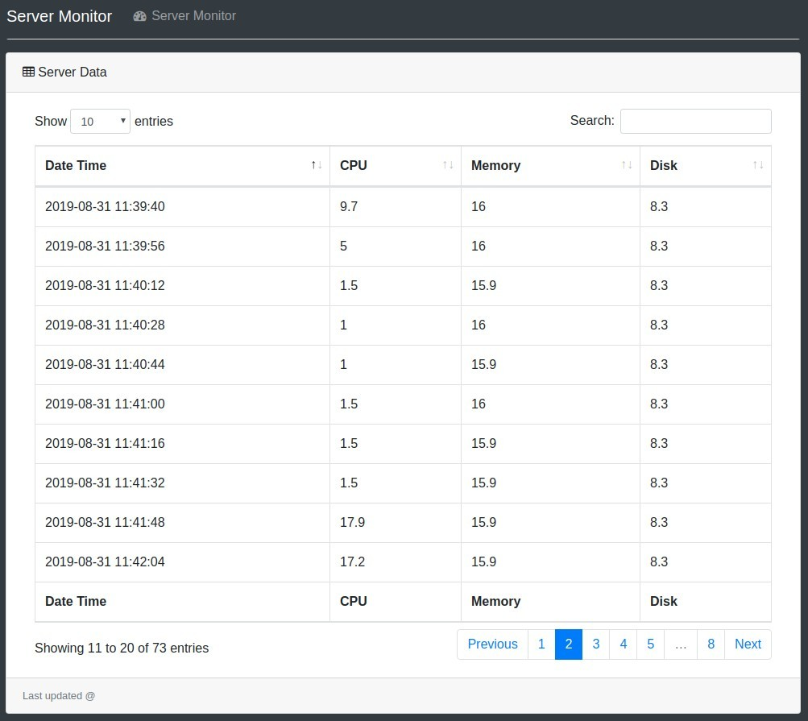

# Server Monitor Dashboard using Pusher API
A simple dashboard to monitor your server's CPU, Memory and Disk Usage (Auto-refreshed every 15 seconds)

# How does it work ?
1) A python script reads the CPU, Memory, Disk usage on the server and sends it to Pusher API
2) You view the results using a simple HTML/js file which pulls the data from Pusher API
3) The results are only accessible using your secure Pusher API key

# Advantages of this method
1) No need to open up ports, configure security/firewall rules, setup https, encryption etc... on your server
2) You can view the results using a simple HTML file on your desktop/laptop/mobile phone.

# Pre-requisite
Sign-up for an account on https://pusher.com/ . Please make a note of your APP_ID, KEY, SECRET, CLUSTER values from the pusher dashboard. Free version allows you to send up to 200K messages a month. This is enough for monitoring 1 server every 15 seconds.

# How to install
Login to your Ubuntu VPS server

1) Install Python3 
`sudo apt-get install python3`
2) Install PIP
`sudo apt-get install python3-pip`
3) Install pusher API & psutil
`pip3 install pusher`
`pip3 install psutil`
4) Download the server-monitor scripts to your server
`wget https://raw.githubusercontent.com/mirrormirage0/server-monitor/master/pusher_config.py`
`wget https://raw.githubusercontent.com/mirrormirage0/server-monitor/master/server_push.py`
5) Login to your pusher.com account and make a note of the APP_ID, KEY, SECRET, CLUSTER values.
6) Edit pusher_config.py and replace the values for my_app_id, my_key, my_secret,my_cluster
`nano pusher_config.py`
After you have replaced the values, press CTRL-O, CTRL-X to write the file and exit.
7) Execute the server_push.py script to start reading your CPU/Memory/Disk usage values and publishing to pusher.
`python3 server_push.py`

You will see the following output
Sleeping for 15 second
Sending a message

When you see this, You can login to your pusher dashboard and see the messages being received. Each message will have the CPU, Memory and Disk usage percentage.

# View the output as graphs/table
Download the server_monitor.js and server_monitor.html files to your Desktop/Mobile.
Edit server_monitor.js and replace the value for PUSHERKEY and PUSHERCLUSTER.
Open server_monitor.html in your browser. 

# TODO 
The easiest way to run the server process in the background is as follows
`tmux new-session -s server-push`
`python3 server_push.py`
Then press CTRL-b , and then press d
This will detach you from tmux session
To reconnect back to the session, use
`tmux attach`
Pressing CTRL-c inside the tmux session will kill the process and stop broadcasting the values.

